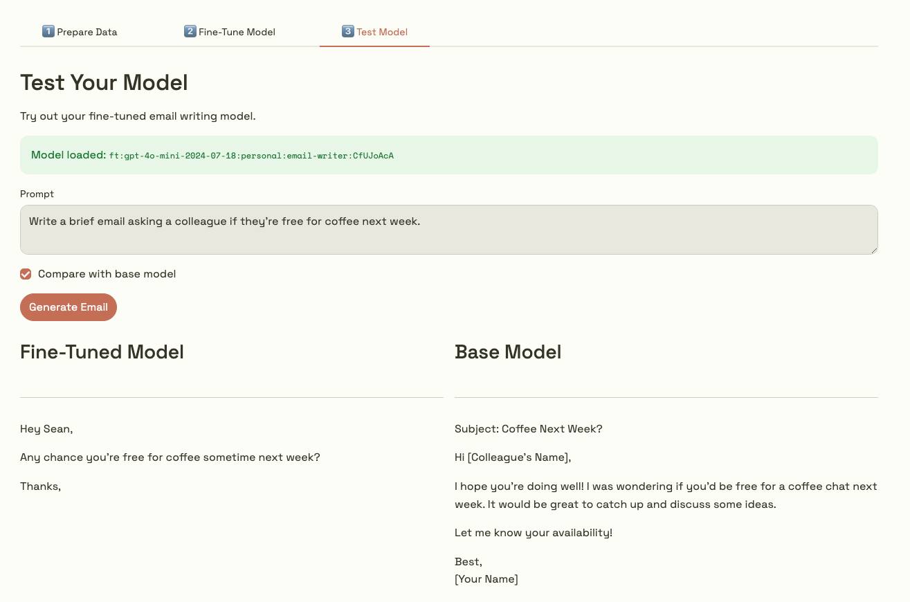
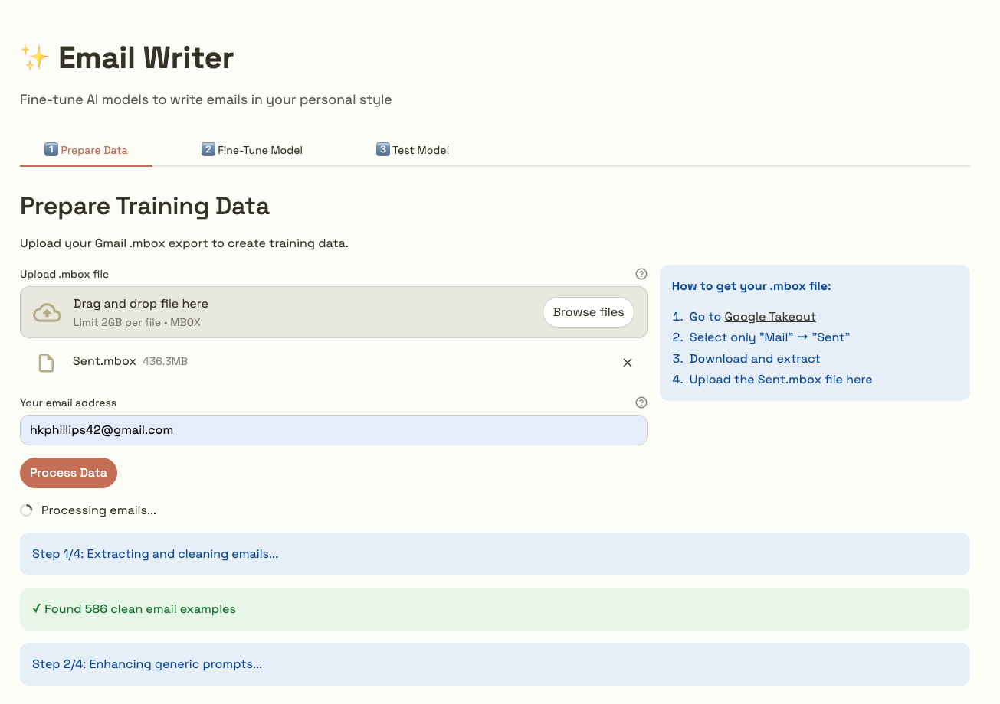

# ✨ Email Writer

A simple tool for fine-tuning OpenAI models to write emails in your personal style & tone.



## Overview

The following describes a basic fine-tuning workflow for writing emails:

1. **Extract & Clean**: Process Gmail .mbox exports into clean training data
2. **Enhance**: Fill in prompts for emails without a 'Reply to' example using synthetic prompt generation
3. **Fine-Tune**: Create a fine-tuning job via OpenAI API `post https://api.openai.com/v1/fine_tuning/jobs`
4. **Test**: Compare your custom model to the base model

## Prerequisites

- Python 3.12 or higher
- OpenAI API key ([Get one here](https://platform.openai.com/api-keys))
- Gmail .mbox export of your Sent folder

## Getting Your Gmail Data

1. Go to [Google Takeout](https://takeout.google.com/)
2. Click "Deselect all"
3. Scroll down and select only "Mail"
4. Click "All Mail data included" and deselect all except "Sent"
5. Choose "Export once" and download format
6. Click "Next step" → "Create export"
7. Download the .mbox file when ready (usually `Sent.mbox`)

## Installation

```bash
# Clone or download this repository
cd email-writer

# Install dependencies
pip install -r requirements.txt
```

## Usage

### Option 1: Web UI (Recommended)

Launch the web interface:

```bash
streamlit run streamlit_app.py
```

Your browser should open a new tab at `http://localhost:####`.

### Option 2: CLI

First, set up your API key:

```bash
cp .env.example .env
# Edit .env and add your OPENAI_API_KEY
```

### Quick Start

```bash
# Step 1: Prepare training data
python prepare_data.py path/to/Sent.mbox your.email@gmail.com

# Step 2: Fine-tune the model
python finetune.py

# Step 3: Test your model
python test_model.py
```

### Step 1: Prepare Data



Converts your Gmail .mbox file into formatted training data.

```bash
python prepare_data.py ~/Downloads/Sent.mbox you@gmail.com
```

**What it does:**

- Extracts sent emails from .mbox file
- Cleans out junk (signatures, quoted text, HTML, etc.)
- Filters unwanted content (auto-generated messages, meeting invites, etc.)
- Enhances generic prompts using AI (batched for efficiency)
- Splits into 90% training / 10% validation
- Estimates fine-tuning costs

**Output files:**

- `training.jsonl` - Your training dataset
- `validation.jsonl` - Validation dataset

**Example output:**

```
📧 Processing mbox file: Sent.mbox
👤 Your email: you@gmail.com

Step 1/4: Extracting and cleaning emails...
  ✓ Found 247 clean email examples

Step 2/4: Enhancing generic prompts...
Found 89 generic prompts to enhance
  Processing batch 1/9 (10 emails)...
  ...
  Enhanced 89 prompts using 9 API calls

Step 3/4: Splitting into training and validation sets...
  ✓ Training examples: 222
  ✓ Validation examples: 25

Step 4/4: Writing output files...
  ✓ Training data: training.jsonl
  ✓ Validation data: validation.jsonl

Cost Estimate:
Total tokens: ~45,000
Prompt enhancement: $0.180
Fine-tuning cost: $0.360
TOTAL ESTIMATED COST: $0.54
```

### Step 2: Fine-Tune Model

Uploads data to OpenAI and creates a fine-tuning job.

```bash
python finetune.py
```

**What it does:**

- Uploads training and validation files to OpenAI
- Creates fine-tuning job with selected base model (default - gpt-4o-mini)
- Monitors progress until completion
- Saves model ID to `model_info.json`

**Example output:**

```
Step 1/3: Uploading files to OpenAI...
  Uploading training.jsonl... ✓ (ID: file-abc123)
  Uploading validation.jsonl... ✓ (ID: file-def456)

Step 2/3: Starting fine-tuning job...
  Creating fine-tuning job... ✓ (Job ID: ftjob-xyz789)

Step 3/3: Monitoring job progress...

This may take 20-60 minutes depending on dataset size.

[18:30:15] Status: validating_files
[18:30:45] Status: running
[18:45:20] Status: running
  Trained tokens: 45,123
[19:15:30] Status: succeeded

✅ Fine-tuning completed successfully!

Fine-tuned model ID: ft:gpt-4o-mini-2024-07-18:personal::abc123xyz

Model info saved to: model_info.json

Next step:
  python test_model.py
```

### Step 3: Test Model

Interactive CLI to test your fine-tuned model.

```bash
python test_model.py
```

**What it does:**

- Loads your fine-tuned model
- Runs quick test examples
- Opens interactive prompt for custom testing
- Can compare outputs with base model

**Example output:**

```
Fine-tuned model: ft:gpt-4o-mini-2024-07-18:personal::abc123xyz
Base model: gpt-4o-mini-2024-07-18

Quick Test Examples:

Example 1: Write a brief email asking a colleague if they're free for coffee next week.
------------------------------------------------------------
Hey Sarah,

Quick question - are you free for coffee sometime next week? Would love to catch up.

Let me know what works!

Interactive Testing Mode

Enter prompts to test your fine-tuned model.
Commands:
  /compare - Compare with base model for the last prompt
  /quit    - Exit

Prompt: Write an email declining a meeting politely
Generating email...
------------------------------------------------------------
Hi John,

Thanks for the invitation. Unfortunately I won't be able to make this one, but I appreciate you thinking of me.

Best,

Prompt: /compare

Comparison: Fine-Tuned vs Base Model
...
```

## Cost Estimates

Actual costs for fine-tuning with gpt-4o-mini (as of 2025):

- **500 emails**: ~$0.87

**Breakdown:**

- Data preparation + prompt enhancement: ~$0.001-0.002 per email
- Fine-tuning: ~$0.008 per 1K tokens (gpt-4o-mini-2024-07-18)
- Using the model: Same as base gpt-4o-mini rates (~$0.15/1M input tokens, ~$0.60/1M output tokens)

## Project Structure

```
email-writer/
├── README.md                 
├── .env.example             
├── requirements.txt         # Python dependencies
│
├── streamlit_app.py         # Web UI 
├── prepare_data.py          # Step 1: Data preparation (CLI)
├── finetune.py             # Step 2: Fine-tuning (CLI)
├── test_model.py           # Step 3: Testing (CLI)
│
├── lib/                     # Shared library code
│   ├── config.py           # Configuration settings
│   ├── email_cleaner.py    # Email extraction & cleaning
│   └── prompt_enhancer.py  # Instruction prompt generation (for emails that aren't repyling to anything)
│
└── examples/
    └── sample_output.jsonl # Example training data format
```

## Configuration

Edit `lib/config.py` to customize:

- **Base model**: Default is `gpt-4o-mini-2024-07-18`
- **Batch size**: Number of prompts to enhance per API call
- **Validation split**: Default 10% validation, 90% training
- **Fine-tuning parameters**: Epochs, learning rate, etc.

## How It Works

### Email Cleaning

The tool removes:

- Quoted text from replies
- Email signatures
- HTML/CSS code
- Auto-generated messages
- Meeting invite details
- Email headers
- Confirmation/tracking emails
- Image-only messages

### Prompt Enhancement

```
Before: "Write an email in your tone."
After:  "Write a brief email asking about project timeline."
```

### Training Data Format

Output is in OpenAI's JSONL format:

```jsonl
{
  "messages": [
    {
      "role": "user",
      "content": "Write an email thanking someone for lunch."
    },
    {
      "role": "assistant",
      "content": "Hey! Thanks so much for lunch today, really enjoyed catching up. Let's do it again soon!"
    }
  ]
}
```

## FAQ

**Q: How many emails do I need?**
A: Minimum 10, but 50-100+ recommended for better results.

**Q: What if I have multiple email accounts?**
A: Export and process each .mbox separately, or combine them manually.

**Q: How do I delete my fine-tuned model?**
A: Go to [OpenAI Fine-tuning Dashboard](https://platform.openai.com/finetune) and delete it there.

**Q: Does this work with other email providers?**
A: This hasn't been tested but in theory yes, as long as you can export to .mbox format.

**Q: Can I use a different base model?**
A: Yes, edit `FINETUNING_BASE_MODEL` in `lib/config.py`. Check OpenAI's docs for available models.

## Troubleshooting

**"Module not found" error:**

```bash
pip install -r requirements.txt
```

**"No such file" error when running finetune.py:**

```bash
# Make sure you ran prepare_data.py first
python prepare_data.py path/to/Sent.mbox your@gmail.com
```

**"Invalid API key" error:**

```bash
# Check your .env file
cat .env
# Make sure OPENAI_API_KEY is set correctly
```
